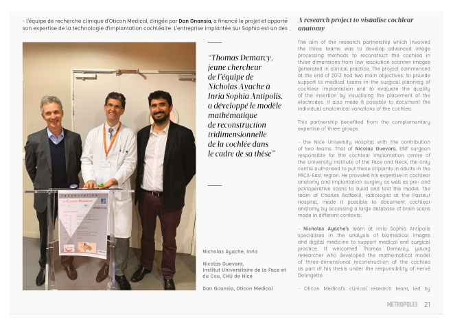
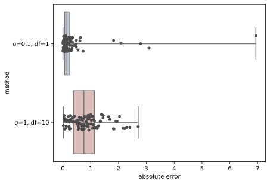

# Contents
1. My background
2. Work philosophy
3. Project demo or code/architecture review
4. Questions

slide deck source: [github.com/tdemarcy/slides-2020-12-07](https://github.com/tdemarcy/slides-2020-12-07)

---
<!-- _class: lead -->

# 1. My background

---

# Profile analysis


Ask my referals:
- Nicholas Ayache
- Hervé Delingette
- Dan Gnansia
- Cédric Briand
- Benjamin Braga
- Jan Margeta

---

# Achievements

1. Bringing a new approach at Oticon Medical

---

## Oticon Medical

* Neurelec until 2013 (PhD 1st year)
* Hardware company
* Less than 10% of market share

---

## Data-driven approach
Throughout the product life cycle:

conception → implantation → fitting

---

## How?
[x] Preop. anatomy reconstruction (PhD, using Bayesian inference)
    → Surgery planning
[x] Postop. electrode reconstruction
    → Design review
[x] Modality registration
    → Insertion depth and trauma evaluation
[x] Fitting (Hz, nC) using images, impedences and demographics data
[  ] Nerve health modelisation using objective measures (e.g. eCAPs)

---

## Press



---

# Achievements

1. Bringing a new approach at Oticon Medical
2. Initial technological design choices approved a posteriori by top management

---

## Technological design

* Use of actively maintained, cross-platform, multiple programming languages (C++, Python, JavaScript, etc.) libraries
* Cloud-based and GDPR compliant
* DevOps automation: Automated testing and container deployment, scaling, and management

---

## Why leaving Oticon Medical?


---
<!-- _class: lead -->

# 2. Work philosophy

---

## Quick-and-dirty?


- quick prototyping
- short-term and long-term velocity
- needs for documentation

---

## Accuracy vs. Robustness

```python
n_sample = 100
error = pd.DataFrame(
    {
        "σ=0.1, df=1": random.standard_t(1, n_sample) * 0.1,
        "σ=1, df=10": random.standard_t(10, n_sample) * 1,
    }
)
abs_error = pd.melt(np.abs(error), var_name="method", value_name="absolute error")

plot_values = {"x": "method", "y": "absolute error", "data": abs_error}
sns.boxplot(**plot_values, **box_options)
sns.stripplot(**plot_values, **strip_options)
```

---

## Accuracy vs. Robustness


*valid for medical UX

---

## From MIC to CAI


Medical Image Computing and Computer Assisted Interventions

---

## My 2 keywords rule


<br />

- **Computer vision**
`or`
- **Medical device**
`or`
- **Data science**

---
<!-- _backgroundColor: black -->
<!-- _paginate: false -->